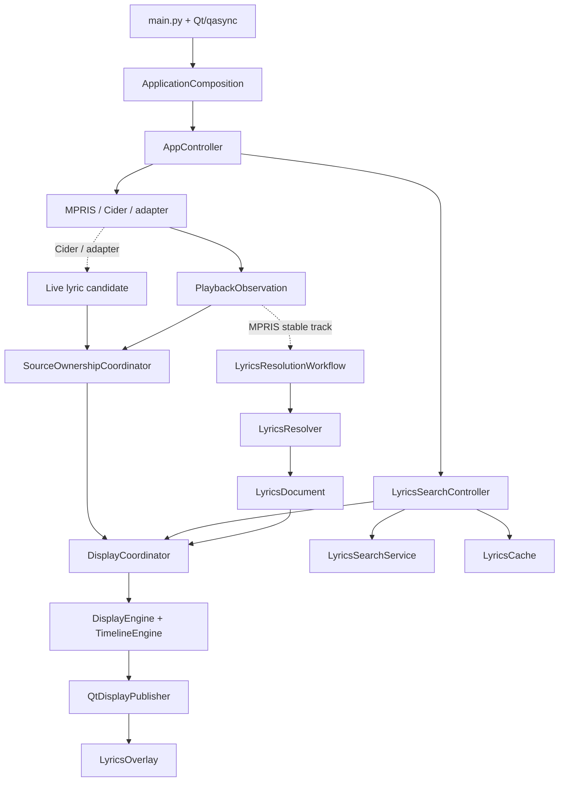

# Architecture

[中文](SPEC.zh-CN.md)

This document describes the current Kotonoha architecture: its runtime flow, layer boundaries, ownership model, lifecycle, and platform behavior.

## Runtime topology

MPRIS, Cider, and external adapters are normalized into playback facts at their boundaries. Cider and adapters may also provide live lyric candidates. Playback source and lyric source are independent dimensions. `DisplayCoordinator` receives a complete lyric document; the display layer derives the current line, context, word progress, and interlude state.

## Layer boundaries

| Layer | Responsibility | Representative modules |
| --- | --- | --- |
| Domain | Value types, lyric parsing and matching, timelines, display projections | `lyrics/`, `playback/`, `display/` |
| Application | Use cases, source arbitration, configuration application, lifecycle | `app/` |
| Boundary | MPRIS D-Bus, Cider HTTP, adapter ingress | `providers/`, `receiver.py` |
| Platform | Compositor capabilities, surfaces, outputs, native bridge | `platform/` |
| Presentation | Qt windows, controls, state binding, tray | `ui/`, `tray.py` |
| Configuration | Typed `Config`, XDG paths, atomic persistence | `config/`, `file_access.py` |
| State | Persistent runtime state and XDG state paths | `state/` |

The domain layer does not depend on Qt, network clients, D-Bus, or the native bridge. Presentation does not create sessions, workers, or caches. Platform adapters do not select lyric sources.

## Ownership

| Owner | Responsibility |
| --- | --- |
| `ApplicationComposition` | The single composition root; creates and injects the concrete object graph |
| `AppController` | Application lifecycle, settings, cache management, manual-search, and timing intents |
| `SourceOwnershipCoordinator` | Arbitration of `mpris`, `cider`, and `adapter` playback candidates and clocks |
| `LyricsResolutionWorkflow` | Generations, cancellation, stale-result isolation, and resolution decisions |
| `LyricsResolver` | Source plans, matching, cache access, and shared lookup tasks |
| `DisplayCoordinator` | `DisplayFrame`, `MediaClock`, and the single display-publisher boundary |
| `TrackOffsetService` | Structured per-lyric timing corrections and persistence lifecycle |
| `LyricsCache` | Asynchronous facade for one SQLite cache, shared by resolution and cache management |
| `TrackOffsetStore` | SQLite state boundary for timing corrections, separate from lyric content cache |
| Providers / receiver | Their own external sessions, polling loops, and connection resources |

Concrete implementations are assembled in `app/composition.py`. Modules do not locate dependencies through global services, widget parents, or deep helpers, and there is only one display publisher.

## Boundary contracts

- External JSON, D-Bus, HTTP, and file input is parsed, validated, and converted to typed values at the boundary.
- Lyric providers and adapters pass complete `LyricsDocument` values. Current-line, context, and interlude values are display projections and do not cross the boundary.
- Cache management uses `LyricsCacheManagementPort`; manual selection uses `LyricsCacheWritePort`. Both ports target the same `LyricsCache` created by the composition root. Cache CRUD does not pass through the MPRIS port.
- Timing corrections use a `TrackOffsetKey` built from normalized recording metadata, a whole-second duration, and lyric identity (`source_id`, provider song id, and content digest). Each change is persisted as one SQLite upsert; the HUD and display projection share `TrackOffsetService`, while `AppController` applies the new display options immediately.
- Platform capabilities return a capability or result with a reason. The UI does not read compositor names or the native bridge directly.
- Overlay dragging delegates coordinate conversion and position synchronization to the selected platform strategy. X11 ordinary windows and Layer Shell compositors retain their existing manual drag models. On a Layer-Shell-less Wayland session such as GNOME/Mutter, the ordinary window requests a compositor-owned system move from the press event; later client coordinates are not used for updates or persistence because Wayland does not provide reliable client-side positioning. Niri binds a Layer Shell surface to one output, so the panel is constrained to that output's logical rectangle and remains on that output when the gesture is released. KDE's default Layer Shell strategy retains release-time output selection and rebinding.

## Lifecycle

- Constructors establish in-memory and UI state only. They do not perform network I/O, start tasks, or register process-wide hooks.
- `AppController.start()` activates and shows the overlay, starts display and search, then attempts to start the adapter receiver, Cider, and MPRIS independently. One unavailable external boundary does not disable the others.
- `AppController.stop()` closes windows and feature tasks, then stops MPRIS, Cider, the receiver, and display, releases overlay surface resources, flushes track-offset state, and finally closes the configuration service.
- Every task, session, worker, and surface has an owner and an explicit cancellation or close path. `start()`, `stop()`, and `close()` are designed to be idempotent where practical.
- MPRIS has no independent shutdown workflow. `MprisProvider.stop()` is an application-shutdown step that ends the MPRIS lyric workflow and its resolver/cache resources.

## State and configuration

| State | Values | Meaning |
| --- | --- | --- |
| Playback source | `mpris`, `cider`, `adapter` | Source of the active playback facts and clock |
| Lyrics source | Provider or local source id | Source that produced the current lyric document |
| Lyrics origin | `network`, `cache`, `live`, `sidecar`, `embedded`, `adapter`, `manual` | How the document entered the display path |
| Cache state | `none`, `from-cache`, `manual` | Relationship between the document and persistent cache |
| Track offset | `TrackOffsetKey` plus a millisecond correction | User timing correction for one recording and one exact lyric version; recording duration in the key is normalized to seconds |

The default configuration path is `$XDG_CONFIG_HOME/kotonoha/config.json`. The default lyric cache path is `$XDG_CACHE_HOME/kotonoha/lyrics.sqlite3`. Timing corrections are stored separately at `$XDG_STATE_HOME/kotonoha/track_offsets.sqlite3`; the table has no arbitrary record-count cap and each change is an individual upsert. The state store migrates its earlier millisecond-duration schema to whole-second durations. When the variables are unset, the paths are `~/.config/kotonoha/`, `~/.cache/kotonoha/`, and `~/.local/state/kotonoha/`. `Config` is the typed settings model; timing corrections are not configuration fields. The legacy JSON `track_offsets` object is ignored because its old string key cannot identify a lyric version, and tokens are excluded from application logs.

When Layer Shell is unavailable, Kotonoha uses a regular Qt window. Blur is an independent capability. Resources associated with an old compositor surface are released before a surface is rebuilt or rebound to another output.

For lyric resolution, cache, and manual selection, see [`SPEC-lyrics.md`](SPEC-lyrics.md). For the external adapter contract, see [`../plugins/README.md`](../plugins/README.md).
