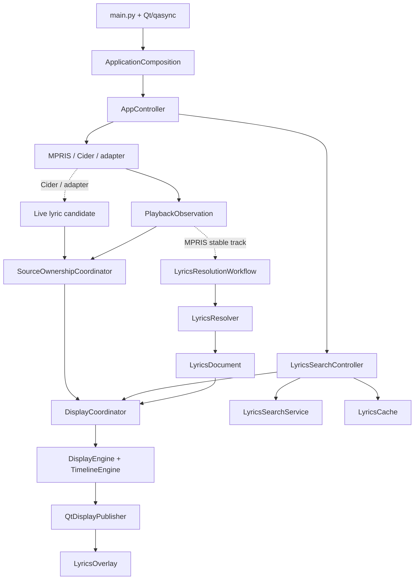

# 当前架构

[English](SPEC.md)

本文记录 Kotonoha 当前实现的系统边界、运行路径、所有权和资源生命周期。

## 运行拓扑

MPRIS、Cider 和外部 adapter 在边界处转换为规范化的播放事实；Cider 和 adapter 还可以携带实时歌词候选。播放来源和歌词来源是两个独立维度。`DisplayCoordinator` 接收完整歌词文档后，展示层负责计算当前行、上下文、逐字进度和 interlude。

## 分层

| 层 | 责任 | 代表模块 |
| --- | --- | --- |
| Domain | 值类型、歌词解析和匹配、时间轴、展示投影 | `lyrics/`、`playback/`、`display/` |
| Application | 用例、来源仲裁、配置应用、生命周期 | `app/` |
| Boundary | MPRIS D-Bus、Cider HTTP、adapter 接收 | `providers/`、`receiver.py` |
| Platform | compositor 能力、surface、output、native bridge | `platform/` |
| Presentation | Qt 窗口、控件、状态绑定、托盘 | `ui/`、`tray.py` |
| Configuration | typed `Config`、XDG 路径、原子持久化 | `config/`、`file_access.py` |
| State | 持久化运行时状态和 XDG state 路径 | `state/` |

Domain 不依赖 Qt、网络客户端、D-Bus 或 native bridge。Presentation 不创建 session、worker 或 cache。Platform 不决定歌词来源策略。

## 所有权

| Owner | 责任 |
| --- | --- |
| `ApplicationComposition` | 作为唯一组合根创建并注入 concrete object graph |
| `AppController` | 应用生命周期、设置、缓存管理、手动搜索和时序偏移 intent |
| `SourceOwnershipCoordinator` | 仲裁 `mpris`、`cider`、`adapter` 的播放候选及其 clock |
| `LyricsResolutionWorkflow` | generation、取消、过期结果隔离和解析决策 |
| `LyricsResolver` | source plan、匹配、cache 和共享查找任务 |
| `DisplayCoordinator` | `DisplayFrame`、`MediaClock` 和唯一 display publisher 边界 |
| `TrackOffsetService` | 结构化歌词时序偏移和持久化生命周期 |
| `LyricsCache` | 一个 SQLite cache 的异步 facade；resolver 和管理窗口共享同一实例 |
| `TrackOffsetStore` | 偏移状态的 SQLite 边界，与歌词内容 cache 分离 |
| Provider / receiver | 各自拥有外部 session、轮询和连接资源 |

具体实现只在 `app/composition.py` 装配。模块不通过全局 service、widget parent 或 deep helper 隐式寻找依赖，也不创建第二套 publisher。

## 关键边界

- 外部 JSON、D-Bus、HTTP 和文件输入在边界处解析、校验并转换为 typed value。
- 歌词 provider 和 adapter 只传递完整 `LyricsDocument`，不传递当前行、上下文或 interlude 等展示派生字段。
- 缓存管理使用 `LyricsCacheManagementPort`，手动应用使用 `LyricsCacheWritePort`。两者都指向组合根创建的同一个 `LyricsCache`，缓存 CRUD 不经过 MPRIS port。
- 时序偏移使用由规范化录音 metadata、按整秒归一化的时长和歌词 identity（`source_id`、provider song ID、内容 digest）构成的 `TrackOffsetKey`。每次变化只执行一条 SQLite upsert；HUD 和 display projection 共享 `TrackOffsetService`，由 `AppController` 立即应用新的显示选项。
- 平台能力以带原因的 capability/result 返回；UI 不直接读取 compositor 名称或 native bridge。
- overlay 拖动使用平台策略进行坐标换算和位置同步。X11 普通窗口和 Layer Shell compositor 保持现有的客户端手动拖动模型；在 GNOME/Mutter 这类没有 Layer Shell 的 Wayland 会话中，普通窗口会在按下事件中请求由 compositor 接管的系统移动，后续客户端坐标不会用于更新或持久化，因为 Wayland 不提供可靠的客户端定位能力。Niri 的 Layer Shell surface 绑定单一 output，因此拖动期间将面板限制在当前 output 的逻辑矩形内，释放时也保持在该 output。KDE 默认的 Layer Shell 策略继续在释放时根据指针选择 output 并执行重绑。

## 生命周期

- 构造函数只建立内存和 UI 状态，不执行网络 I/O、不启动 task、不注册进程级 hook。
- `AppController.start()` 先激活并显示 overlay，再启动 display 和 search，之后分别尝试启动 adapter、Cider 和 MPRIS。某个外部边界不可用不影响其他功能。
- `AppController.stop()` 先关闭窗口和 feature task，再停止 MPRIS、Cider、receiver 和 display，释放 overlay surface 资源，flush 时序偏移状态，最后关闭配置 service。
- 所有 task、session、worker 和 surface 都有明确 owner、取消或关闭路径；`start()`、`stop()`、`close()` 尽量幂等。
- MPRIS 没有独立关闭工作流。`MprisProvider.stop()` 只是应用关闭时的内部步骤，并负责结束 MPRIS lyric workflow 及其 resolver/cache 资源。

## 状态和配置

| 状态 | 值 | 含义 |
| --- | --- | --- |
| Playback source | `mpris`、`cider`、`adapter` | 当前播放事实和时钟的来源 |
| Lyrics source | provider 或本地来源 id | 生成当前歌词文档的来源 |
| Lyrics origin | `network`、`cache`、`live`、`sidecar`、`embedded`、`adapter`、`manual` | 文档进入显示路径的方式 |
| Cache state | `none`、`from-cache`、`manual` | 当前文档与持久 cache 的关系 |
| Track offset | `TrackOffsetKey` 加毫秒偏移值 | 针对一首录音和一个精确歌词版本的用户时序修正；key 中录音时长按秒归一化 |

配置默认位于 `$XDG_CONFIG_HOME/kotonoha/config.json`，歌词 cache 默认位于 `$XDG_CACHE_HOME/kotonoha/lyrics.sqlite3`，时序偏移单独存储在 `$XDG_STATE_HOME/kotonoha/track_offsets.sqlite3`，且没有任意的记录数上限，每次变化只执行一条 upsert。状态存储会把旧的毫秒时长 schema 迁移为整秒时长。未设置对应变量时分别使用 `~/.config/kotonoha/`、`~/.cache/kotonoha/` 和 `~/.local/state/kotonoha/`。`Config` 是 typed settings model，时序偏移不是配置字段。旧 JSON 中的 `track_offsets` 会被忽略，因为旧字符串 key 无法识别具体歌词版本；token 不写入日志。

Wayland Layer Shell 不可用时使用普通 Qt window；blur 是独立 capability。重建 surface 或重新绑定 output 前，必须释放旧 surface 关联的 compositor 资源。

歌词、cache 和手动选词的模型与流程见 [`SPEC-lyrics.zh-CN.md`](SPEC-lyrics.zh-CN.md)，外部 adapter 协议见 [`../plugins/README.zh-CN.md`](../plugins/README.zh-CN.md)。
